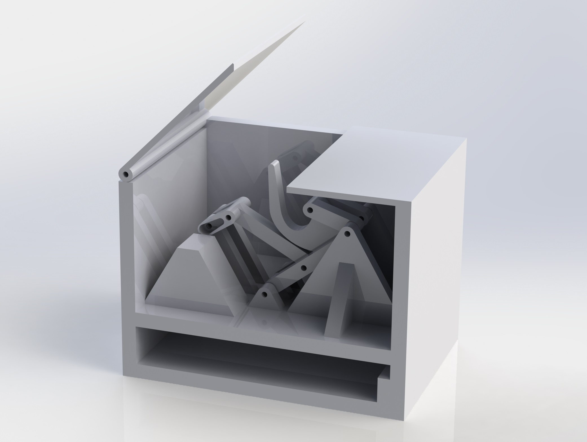

# Useless Machine

This repository contains a project with the design of a solar follower and its remote control, along with the Arduino codes to control them.
The repository also contains a LabVIEW program to monitor the solar panel readings and to switch from manual to automatic control.

## Folders
* Inside the [Arduino](Arduino) folder, we can find the code for the useless machine.
* Inside the [SolidWorks](SolidWorks) folder, we can find all the 3D parts and the assembly regarding the mechanical design of the useless machine.

## Author
* Josep Rueda Collell: rueda_999@hotmail.com
* Freddy Puyal Rodriguez

